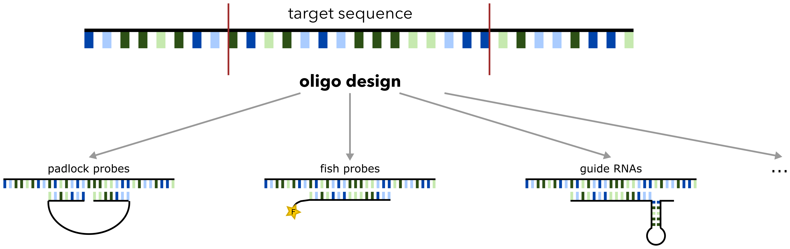

<div align="center">

# Oligo Designer Toolsuite


	
[Docs] | [Tutorials] |

[Docs]: https://quicksetup-ai.readthedocs.io/
[Tutorials]: https://oligo-designer-toolsuite.readthedocs.io/en/latest/tutorial.html

</div>

Oligonucleotides (abbrev. oligos) are short, synthetic strands of DNA or RNA that have many application areas, ranging from research to disease diagnosis or therapeutics. Oligos can be used as primers during DNA amplification, as probes for *in situ* hybridization or as guide RNAs for CRISPR-based gene editing. Based on the intended application and experimental design, researchers can customize the length, sequence composition, and thermodynamic properties of the designed oligos.

*Oligo Designer Toolsuite* is a collection of modules that provide all basic functionalities for custom oligo design pipelines within a flexible Python framework. All modules have a standardized I/O format and can be combined individually depending on the required processing steps. In addition, we already provide oligo design pipelines for specific experimental setups, e.g. Padlock Probes for Spatial Transcriptomics. 

<div align="center">


	
</div>


## Installation

**Requirements:**

This packages was tested for ```Python 3.9 - 3.10``` on ubuntu. It depends on the following additional tools **Blast**, **BedTools**, **Bowtie** and **Bowtie2** that need to be installed independently. To install those tools via conda, please activate the Bioconda channel in your conda environment with:

```
conda config --add channels bioconda
```

Follow this instruction to install the required additional tools:

- **Blast** (2.12 or higher) can be instelled via [NCBI webpage](https://blast.ncbi.nlm.nih.gov/Blast.cgi?PAGE_TYPE=BlastDocs&DOC_TYPE=Download) or via [Bioconda](http://bioconda.github.io/recipes/blast/README.html) installation of Blast with:

		conda install blast

- **BedTools** (2.30 or higher) can be installed via [BedTools GitHub](https://bedtools.readthedocs.io/en/latest/content/installation.html) or via [Bioconda](http://bioconda.github.io/recipes/bedtools/README.html) installation of BedTools with:

		conda install bedtools
		
- **Bowtie** (1.3 or higher) can be installed via [Bowtie webpage](https://bowtie-bio.sourceforge.net/manual.shtml#obtaining-bowtie) or via [Bioconda](http://bioconda.github.io/recipes/bowtie/README.html) installation of Bowtie with:

		conda install bowtie

- **Bowtie2** (2.5 or higher) can be installed via [Bowtie2 webpage](https://bowtie-bio.sourceforge.net/bowtie2/manual.shtml#obtaining-bowtie-2) or via [Bioconda](http://bioconda.github.io/recipes/bowtie2/README.html) installation of Bowtie2 with:

		conda install bowtie2

All other required packages are automatically installed if installation is done via :code:`pip`.

**Install Options:**

The installation of the package is done via pip. Note: if you are using conda, first install pip with: ```conda install pip```.

PyPI install:

```
pip install oligo-designer-toolsuite
```


Installation from source:

```
git clone https://github.com/HelmholtzAI-Consultants-Munich/oligo-designer-toolsuite.git
```

- Installation as python package (run inside directory):

		pip install .   


- Development Installation as python package (run inside directory):

		pip install -e . [dev]

## License

The oligo-designer-toolsuite package is MIT licensed.

## Contributing

Contributions are more than welcome! Everything from code to notebooks to examples and documentation are all equally valuable so please don't feel you can't contribute. To contribute please fork the project make your changes and submit a pull request. We will do our best to work through any issues with you and get your code merged into the main branch.
