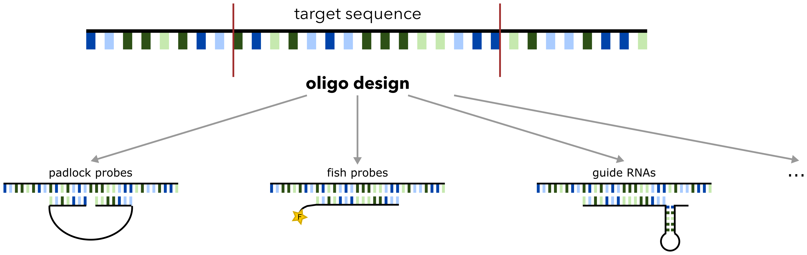

# Oligo Designer Toolsuite

Oligonucleotides (abbrev. oligos) are short, synthetic strands of DNA or RNA that have many application areas, ranging from research to disease diagnosis or therapeutics. Oligos can be used as primers during DNA amplification, as probes for *in situ* hybridization or as guide RNAs for CRISPR-based gene editing. Based on the intended application and experimental design, researchers can customize the length, sequence composition, and thermodynamic properties of the designed oligos.

Various tools exist that provide custom design of oligo sequences depending on the area of application. Interestingly, all those pipelines have many common basic processing steps, ranging from the generation of custom-length oligo sequences, the filtering of oligo sequences based on thermodynamic properties as well as the selection of an optimal set of oligos. Despite the fact that most tools apply the same basic processing steps, each newly developed tool usually uses its own implementation and different versions of package dependencies for those basic processing steps. As a consequence, the comparability of tools that differ only in certain steps is hampered, but also the development of new tools and the update of existing tools is slowed down, because developers do not have a common resource for basic functionalities to fall back on. We tackle this issue by providing such a common resource in our *Oligo Designer Toolsuite*. This Toolsuite is a collection of modules that provide all basic functionalities for custom oligo design pipelines within a flexible Python framework. All modules have a standardized I/O format and can be combined individually depending on the required processing steps. 



## Installation

**Requirements:**

This package was build with Python 3.8 

| Package  | Version |
| ------------- | ------------- |
| argparse  | 1.4.0  |
| Bio  | 1.3.8  |
| datetime | 4.4 |
| gtfparse  | 1.2.1 |
| iteration_utilities  | 0.11.0 |
| networkx  | 2.8.1 |
| pandas  | 1.4.2 |
| pybedtools  | 0.9.0 |
| pyfaidx  | 0.6.4 |
| pyyaml  | 6.0 |


All required packages are automatically installed if installation is done via ```pip```.


**Install Options:**

PyPI install:

```
pip install oligo-designer-toolbox
```

Installation of the package via pip from source:

```
git clone https://github.com/HelmholtzAI-Consultants-Munich/oligo-designer-toolsuite.git         

pip install .        (Installation as python package: run inside directory)

pip install -e .        (Development Installation as python package: run inside directory)
```

Note: if you are using conda, first install pip with: ```conda install pip```

In addition to the packages listed above, you need to install *Blast* and *BedTools* Software. *Blast* can installed via [NCBI webpage](https://blast.ncbi.nlm.nih.gov/Blast.cgi?PAGE_TYPE=BlastDocs&DOC_TYPE=Download) or via ```Bioconda``` installation of Blast with ```conda install -c bioconda blast``` and *BedTools* can be installed via [BedTools GitHub](https://bedtools.readthedocs.io/en/latest/content/installation.html) or via Bioconda installation of BedTools with ```conda install -c bioconda bedtools```.

# Implemented Oligo Design Pipelines

## Padlock Probe Design

A padlock probe contains a constant backbone sequence of 53 nucleotides (nt) and the 5’- and 3’- arms, which are complementary to the corresponding mRNA sequence. The gene-specific arms of padlock probes are around 20nt long each, thus the total length of the gene-specific sequence of each padlock is 40nt.


### Usage

**Command-Line Call:**

To create padlock probes you can run the pipeline with 

```
padlock_probe_designer -c ./config/padlock_probe_designer.yaml -o output/ [-d False]
````

where:

- ```-c```: config file, which contains parameter settings, specific to padlock probe design, *./config/padlock_probe_designer.yaml* contains default parameter settings
- ```-o```: output folder, where results of pipeline are stored
  - ```annotations```folder: downloaded gene and genome annotation as well as constructed transcriptome
  - ```probes```folder: list of probes per gene, which fulfill user-defined criteria, given in config file
  - ```probesets```folder: sets of non-overlapping probes per gene, ranked by best set criteria
  - ```padlock_probes```folder: final padlock probe sequences per gene, ready to order
- ```-d```: optional, 'download only' option, where only gene and genome annotation files are downloaded but no probes generated, default: False

All steps and config parameters will be documented in a log file, that is saved in the directory where the pipeline is executed from. The logging file will have the format: ```log_padlock_probe_designer_{year}-{month}-{day}-{hour}-{minute}.txt```.

**Python Import:**

Import padlock probe design pipeline as python package:

```
import oligo_designer_toolsuite.pipelines.padlock_probe_designer as packlock_probe_designer

config = './config/padlock_probe_designer.yaml'
dir_output = './padlock_probes'

annotations = packlock_probe_designer.download_annotations(config, dir_output)
packlock_probe_designer.filter_probes(config, annotations, dir_output)
del annotations # free memory

packlock_probe_designer.generate_probe_sets(config, dir_output)
packlock_probe_designer.design_padlock_probes(config, dir_output)
```
