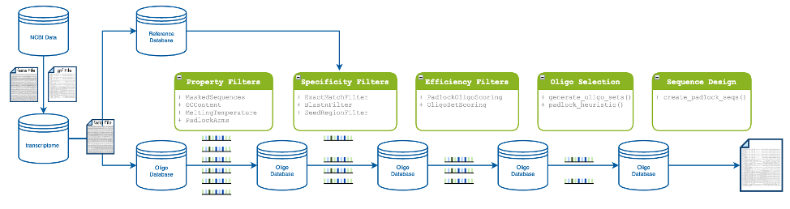

Introduction to the Python Framework
=================================================

The Oligo Designer Toolsuite is a collection of modules that provide basic functionalities for custom oligo design pipelines within a flexible Python framework.
All modules have a common underlying data structure and a standardized API, which allows the user to easily combine different modules depending on the required processing steps.

|image0|

This section gives an overview on the main components of the toolsuite and it's underlying datastructure, to understand how the Oligo Designer Toolsuite can be used to implement a custom oligo design pipeline.
For a practical example of how to use this framework to build a custom oligo design pipeline, please have a look the tutorial :doc:`../_tutorials/build_a_custom_pipeline`

Data Model
------------

The underlying datastructure of the Oligo Designer Toolsuite framework is constituted by the ``OligoDatabase`` class.
The ``OligoDatabase`` class comprises a ``database`` attribute, metadata information of the database content and all related read, create and write functionalities for the database.

The database attribute ``OligoDatabase.database`` stores the oligos sequences for a given set of regions with additional information for each oligo in a dictionary structure:

..  code-block:: python

	{"region_id":
		{"oligo_id":
			{'sequence': Seq('GAACTCAagaggaaaaaaatccagTACTTGACTCGTGG'),
			'chromosome': '6',
			'start': [26373289, ...],
			'end': [26374330, ...],
			'strand': '+',
			'length': 38,
			'additional_information_fasta': ['transcript_id=XM_047418113.1,exon_number=9;...],
			...,
			'additional features': value,
			'GC_content': 52.0 # Example of additional features
			}
		}
	}

Each module in the framework takes as input an ``OligoDatabase`` object.
Additional oligo features that are computed in the module (e.g. GC content of an oligo sequence) are stored within the ``database`` attribute.
Oligos that don't meet module specific filtering criteria are removed from the ``database`` attribute and the updated ``OligoDatabase`` object returned.

The ``ReferenceDatabase`` class is used to store the reference sequence needed for different alignment methods (e.g. Blast, Bowtie, ...).
It aditionally allows to filter the sequences w.r.t. a list of regions, keeping only the sequences belonging to those regions.

Working principle
-----------------

On a higher level, the package is structured in a way that the modules resemble the individual processing steps of a custom oligo design pipeline:

- **Database**: generation of fasta files for specific genomic regions, that can be used to create ``OligoDatabase`` or ``ReferenceDatabase``

- **Oligo Property Filters**: filtering of oligos based on specific oligo properties (e.g. 52.0 < Melting Temperature < 57.0 )

- **Oligo Specificity Filters**: filtering of oligos with high off-target hits using alignement methods such as Bowtie or Blast

- **Oligo Efficiency Filters**: filtering of oligos with low efficiency, based on experiment specific scoring methods

- **Oligo Selection**: generation of the oligo sets that fulfill certain experimen-specific criteria (e.g. using an application-specific scoring function)

- **Sequence Design**: design of final experiment-specific oligo sequence (e.g. including primers, readout probes, detection probes, ...)

For each module we have:

- **Application-Specific Modules**: modules that compute application specific properties that are used to filter the ``OligoDatabase`` (e.g. a filter for oligo GC content)

- **General Modules**: a module that combines the application-specific modules in a flexible way by applying user selected application-specific modules to the input database
