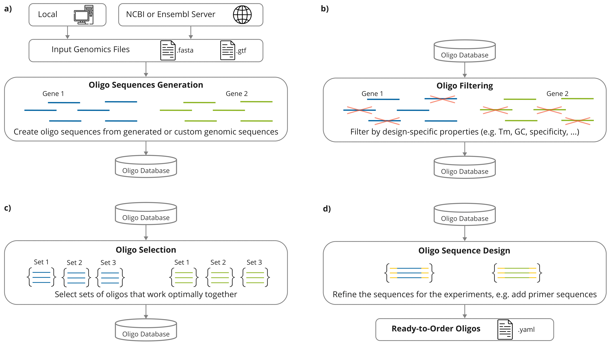
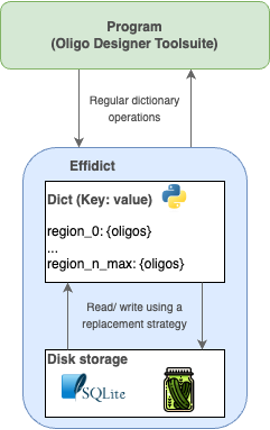

Introduction to the Python Framework
=================================================

The Oligo Designer Toolsuite is a collection of modules that provide basic functionalities for custom oligo design pipelines within a flexible Python framework.
All modules have a common underlying data structure and a standardized API, which allows the user to easily combine different modules depending on the required processing steps. 

This section will cover the core components of the framework and it's underlying data structure.
For explanations on how to customize and setup an oligo design pipeline, please have a look the tutorial :doc:`./build_a_custom_pipeline`

Data Structure
---------------

The underlying data structure implemented in the ``OligoDatabase`` class is designed to efficiently manage, store, and retrieve oligonucleotide sequences and their associated attributes. 
This data structure organizes oligo records in a dictionary-like format, allowing for structured storage of sequence information, annotations, and experimental parameters. 
Due to its structure, the OligoDatabase class enables seamless integration with other modules in the framework, supporting operations such as querying, filtering, and updating records. 

The OligoDatabase class is based on an `EffiDict <https://github.com/HelmholtzAI-Consultants-Munich/EffiDict>`__ data structure to optimize storage and retrieval efficiency. The EffiDict is a specialized dictionary-like structure that 
enhances performance by minimizing memory usage while providing rapid access to oligo records. The EffiDict achieves its efficiency by storing a maximum of *n_max* entries in memory and 
leveraging lazy loading techniques, where data is loaded only when accessed. This results in a smaller memory footprint, which is particularly advantageous when working with 
extensive oligo libraries. By using EffiDict, the OligoDatabase can handle high-throughput operations and complex queries more effectively, ensuring that even as the database grows, 
performance remains consistent and resource usage stays manageable. 

The database attribute ``OligoDatabase.database`` stores the oligos sequences for a given set of regions with additional information for each oligo in a dictionary-like structure:

..  code-block:: python

	{"region_id":
		{"oligo_id":
			{'oligo': Seq('GAACTCAagaggaaaaaaatccagTACTTGACTCGTGG'),
			'target': Seq('CCACGAGTCAAGTActggatttttttcctctTGAGTTC'),
			'chromosome': [['16'], ...]
			'start': [[75242632], ...],
			'end': [[75242676], ...],
			'strand': [['-'], ...],
			...,
			'additional features': value,
			'source': [['NCBI']], # Example of additional features
			'GC_content': 52.0 # Example of additional features
			}
		}
	}

The ``ReferenceDatabase`` class is used to store the reference sequence needed for different alignment methods (e.g. Blast, Bowtie, ...).
This database allows users to compare target oligonucleotide sequences against a broad range of genomic sequences to ensure specificity and avoid off-target effects.

Oligo Sequence Generation
--------------------------

The *Oligo Sequence Generation* block provides the user with different options to generate custom length oligo sequences.
An initial pool of oligo sequences can be generated using the ``OligoSequenceGenerator`` class. 
It can be used to generate sequences form an input FASTA file, containing genomic sequences of interest (e.g. a defined set of genes), or at random with a pre-defined nucleotide distribution.
The generated oligo sequences (or a FASTA file with custom oligo sequences) can be loaded into the ``OligoDatabase`` for further processing.

Oligo Filtering
----------------

The *Oligo Filtering* block offers diverse filtering modules that ensure that the oligos comply with experimental requirements. 
These modules comprise filters based on the physical properties of the oligo sequence, such as melting temperature and GC content, as well as the specificity of the oligos with respect to their target region. 
Here, the latter refers to deleting oligos that have unintended but suitable binding sites outside the targeted region of the genome, which would compromise the results of experiments.
Such off-target hits are identified using alignment methods like as Bowtie, Blast or AI filters.

Oligo Selection
----------------

The *Oligo Selection* block focuses on selecting sets of oligos that have high binding efficiency to the binding site based on experiment specific scoring methods.
Additionally, the ``OligosetGenerator`` classes generate sets of oligos that work optimally together for specific experimental conditions, 
e.g. ensuring the oligos don't compete for binding sites.

Oligo Sequence Design
----------------------

The *Oligo Sequence Design* block provides different functionalities that help the user render the
raw oligo sequences for experimental purposes. The sequence refinements include the addition of primers, barcodes or
other necessary sequence modifications, providing the user with ready-to-order oligo sequences. 
Those functionalities are pipeline dependent and are implemented in each individual pipeline.

All modules of each building block are specifically designed to seamlessly integrate with one another. 
To this end, each module is based on a standardized API, which accepts as input and yields as output the same object type, 
i.e. an ``OligoDatabase`` object. Having a common API allows the user to custom-fit the order of the modules depending on their specific needs.
