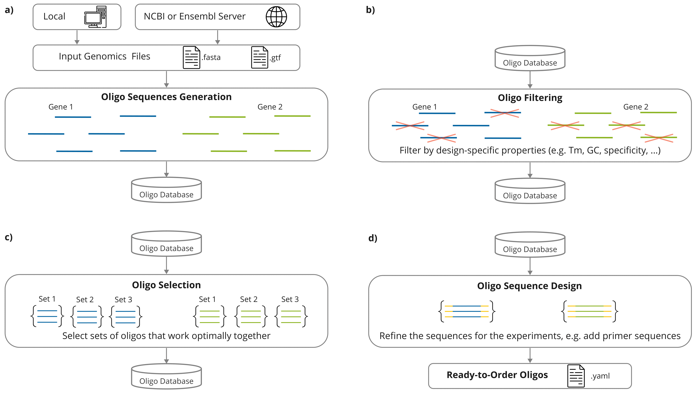

Introduction to the Python Framework
=================================================

The Oligo Designer Toolsuite is a collection of modules that provide basic functionalities for custom oligo design pipelines within a flexible Python framework.
All modules have a common underlying data structure and a standardized API, which allows the user to easily combine different modules depending on the required processing steps. 

|image0|

TThis section will cover the core components of the framework and it's underlying data structure.
For a practical examples of pipeline setups, and explainations on how users can leverage the suite to customize oligo design for their specific needs, 
please have a look the tutorial :doc:`../_tutorials/build_a_custom_pipeline`

Data Structure
---------------

The underlying data structure implemented in the ``OligoDatabase`` class is designed to efficiently manage, store, and retrieve oligonucleotide sequences and their associated attributes. 
This data structure organizes oligo records in a dictionary-like format, allowing for structured storage of sequence information, annotations, and experimental parameters. 
Due to its structure, the OligoDatabase class enables seamless integration with other modules in the framework, supporting operations such as querying, filtering, and updating records. 

The OligoDatabase class is based on an EffiDict data structure to optimize storage and retrieval efficiency. The EffiDict is a specialized dictionary-like structure that 
enhances performance by minimizing memory usage while providing rapid access to oligo records. The EffiDict achieves its efficiency by storing a maximum of *n_max* entries in memory and 
leveraging lazy loading techniques, where data is loaded only when accessed. This results in a smaller memory footprint, which is particularly advantageous when working with 
extensive oligo libraries. By using EffiDict, the OligoDatabase can handle high-throughput operations and complex queries more effectively, ensuring that even as the database grows, 
performance remains consistent and resource usage stays manageable. 

The database attribute ``OligoDatabase.database`` stores the oligos sequences for a given set of regions with additional information for each oligo in a dictionary structure:

..  code-block:: python

	{"region_id":
		{"oligo_id":
			{'oligo': Seq('GAACTCAagaggaaaaaaatccagTACTTGACTCGTGG'),
			'target': Seq('CCACGAGTCAAGTActggatttttttcctctTGAGTTC'),
			'chromosome': [['16'], ...]
			'start': [[75242632], ...],
			'end': [[75242676], ...],
			'strand': [['-'], ...],
			...,
			'additional features': value,
			'source': [['NCBI']], # Example of additional features
			'GC_content': 52.0 # Example of additional features
			}
		}
	}

The ``ReferenceDatabase`` class is used to store the reference sequence needed for different alignment methods (e.g. Blast, Bowtie, ...).
This database allows users to compare target oligonucleotide sequences against a broad range of genetic sequences to ensure specificity and avoid off-target effects.

Oligo Sequence Generation
--------------------------

Oligo Filtering
----------------

Oligo Selection
----------------

Oligo Sequence Design
----------------------

Working principle
-----------------

On a higher level, the package is structured in a way that the modules resemble the individual processing steps of a custom oligo design pipeline:

- **Database**: generation of fasta files for specific genomic regions, that can be used to create ``OligoDatabase`` or ``ReferenceDatabase``

- **Oligo Property Filters**: filtering of oligos based on specific oligo properties (e.g. 52.0 < Melting Temperature < 57.0 )

- **Oligo Specificity Filters**: filtering of oligos with high off-target hits using alignement methods such as Bowtie or Blast

- **Oligo Efficiency Filters**: filtering of oligos with low efficiency, based on experiment specific scoring methods

- **Oligo Selection**: generation of the oligo sets that fulfill certain experimen-specific criteria (e.g. using an application-specific scoring function)

- **Sequence Design**: design of final experiment-specific oligo sequence (e.g. including primers, readout probes, detection probes, ...)

For each module we have:

- **Application-Specific Modules**: modules that compute application specific properties that are used to filter the ``OligoDatabase`` (e.g. a filter for oligo GC content)

- **General Modules**: a module that combines the application-specific modules in a flexible way by applying user selected application-specific modules to the input database
