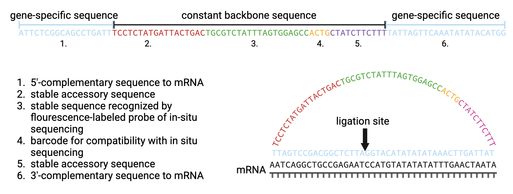
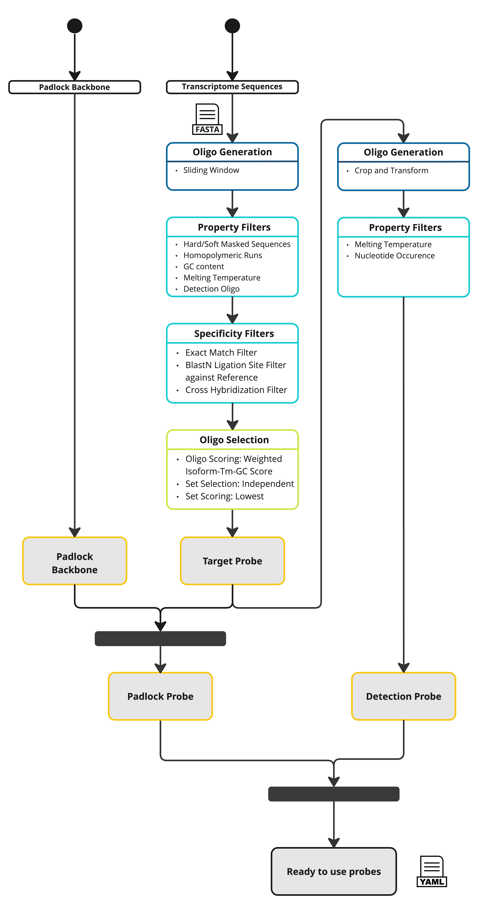

SCRINSHOT Probe Designer
==========================

Padlock probes are short single-stranded oligos designed to bind a target sequence at both their 5′ and 3′ ends.
Once hybridized, the probe’s ends are ligated to form a circular molecule that can then be amplified or visualized in situ.
Scrinshot (Single-Cell RNA In-Situ Hybridization and Sequencing On Tissue) uses these padlock probes to detect and quantify specific RNA
transcripts at single-cell resolution, enabling highly multiplexed and spatially resolved gene expression analysis.

Padlock probes contain two variable gene-specific 5’- and 3’- arms and a stable backbone sequence of 53 nucleotides (nt) which is subdivided in four parts.
Circularized padlock probe is hybridized to the complementary sequence of the corresponding mRNA

If you are using the SCRINSHOT Probe Design Pipeline, consider citing the Oligo Designer Toolsuite package [1] and in addition Kuemmerle et al. [2]
The SCRINSHOT Probe Design Pipeline follows the design steps listed in [3].

Command-Line Call
------------------

To create SCRINSHOT probes you can run the pipeline with

::

    scrinshot_probe_designer -c data/configs/scrinshot_probe_designer.yaml

where:

``-c``: config file, which contains parameter settings, specific to SCRINSHOT probe design, `scrinshot_probe_designer.yaml <https://github.com/HelmholtzAI-Consultants-Munich/oligo-designer-toolsuite/blob/main/data/configs/scrinshot_probe_designer.yaml>`__ contains default parameter settings

All steps and config parameters will be documented in a log file, that is saved in the defined output directory.
The logging file will have the format: ``log_scrinshot_probe_designer_{year}-{month}-{day}-{hour}-{minute}.txt``.

Python API
------------------

The SCRINSHOT probe design pipeline can also be integrated directly into Python code.
Below is an example demonstrating how this can be done.
For a complete explanation of all function parameters, refer to the API documentation.

.. code-block:: python

    ##### Initialize the SCRINSHOT Probe Designer Pipeline #####
    # We create an instance of the ScrinshotProbeDesigner class. This pipeline handles
    # all steps required to design probes for SCRINSHOT experiments, including target probes,
    # readout probes, primers, and final output.
    pipeline = ScrinshotProbeDesigner(
            write_intermediate_steps=True,
            dir_output="output_merfish_probe_designer",
            n_jobs=2,
        )

    # Optional: If you need to customize certain developer parameters (for debugging, advanced usage, etc.),
    # call set_developer_parameters(...) with any overrides. By default, the pipeline uses internal defaults.
    pipeline.set_developer_parameters(...)

    ##### Design Target Probes #####
    # We first generate probes that hybridize specifically to target genes sequences.
    # The pipeline will generate multiple candidate sets (n_sets) and return them as part of the probe database.
    target_probe_database = pipeline.design_target_probes(
        files_fasta_target_probe_database=...,                  # List of FASTA files with target gene sequences
        files_fasta_reference_database_targe_probe=...,         # List of FASTA files for specificity reference
        gene_ids=...,                                           # List of gene symbols or identifiers
        target_probe_length_min=40,
        target_probe_length_max=45,
        target_probe_isoform_consensus=50,
        target_probe_GC_content_min=40,
        target_probe_GC_content_opt=50,
        target_probe_GC_content_max=60,
        target_probe_Tm_min=65,
        target_probe_Tm_opt=70,
        target_probe_Tm_max=75,
        target_probe_homopolymeric_base_n={"A": 5, "T": 5, "C": 5, "G": 5},
        target_probe_padlock_arm_Tm_dif_max=2,
        target_probe_padlock_arm_length_min=10,
        target_probe_padlock_arm_Tm_min=50,
        target_probe_padlock_arm_Tm_max=60
        target_probe_ligation_region_size=5
        target_probe_isoform_weight=2,
        target_probe_GC_weight=1,
        target_probe_Tm_weight=1,
        set_size_opt=5,
        set_size_min=3,
        distance_between_target_probes=0,
        n_sets=100,
    )

    ##### Design Detection Oligos #####
    # Generate short 'detection oligos' that hybridize to a region of the padlock probe,
    # These oligos must conform to specified length, Tm, and base composition rules.
    oligo_database = pipeline.design_detection_oligos(
        oligo_database=oligo_database,
        detection_oligo_length_min=15,
        detection_oligo_length_max=40,
        detection_oligo_min_thymines=2,
        detection_oligo_U_distance=5,
        detection_oligo_Tm_opt=56,
    )

    ##### Design Padlock Backbone #####
    # This step finalizes the design of the padlock backbone portion,
    # incorporating any additional structural or sequence elements
    # required for SCRINSHOT probe circularization and ligation.
    oligo_database = pipeline.design_padlock_backbone(
        oligo_database=oligo_database
    )

    ##### Generate Final Output #####
    # The pipeline then generates its final outputs for the 'top_n_sets'
    # best scoring probe sets to keep.
    pipeline.generate_output(
        oligo_database=oligo_database,
        top_n_sets=3,
    )

Pipeline Description
-----------------------

The pipeline has four major steps:

1) probe generation (dark blue),

2) probe filtering by sequence property and binding specificity (light blue),

3) probe set selection for each gene (green), and

4) final probe sequence generation (yellow).

For the probe generation step, the user has to provide a FASTA file with genomic sequences which is used as reference for the generation of probe sequences.
The probe sequences are generated using the ``OligoSequenceGenerator``.
Therefore, the user has to define the probe length (can be given as a range), and optionally provide a list of gene identifiers (matching the gene identifiers of the annotation file) for which probes should be generated.
If no gene list is given, probes are generated for all genes in the reference.
The probe sequences are generated in a sliding window fashion from the DNA sequence of the non-coding strand, assuming that the sequence of the coding strand represents the target sequence of the probe.
The generated probes are stored in a FASTA file, where the header of each sequence stores the information about its reference region and genomic coordinates.
In a next step, this FASTA file is used to create an ``OligoDatabase``, which contains all possible probes for a given set of genes.
When the probe sequences are loaded into the database, all probes of one gene having the exact same sequence are merged into one entry, saving the transcript, exon and genomic coordinate information of the respective probes.

In the second step, the number of probes per gene is reduced by applying different sequence property (``PropertyFilter``) and binding specificity filters (``SpecificityFilter``).
For the SCRINSHOT protocol, the following sequence property filters are applied: removal of probes that contain unidentified nucleotides (``HardMaskedSequenceFilter``), that contain low-complexity region like repeat regions (``SoftMaskedSequenceFilter``), that have a GC content (``GCContentFilter``) or melting temperature (``MeltingTemperatureNNFilter``) outside a user-specified range, that contain homopolymeric runs of any nucleotide longer than a user-specified threshold (``HomopolymericRunsFilter``), that cannot form valid detection oligos (``DetectionOligoFilter``).
After removing probes with undesired sequence properties from the database, the probe database is checked for probes that potentially cross-hybridize, i.e. probes from different genes that have the exact same or similar sequence.
Those probes are removed from the database to ensure uniqueness of probes for each gene.
Cross-hybridizing probes are identified with the ``CrossHybridizationFilter`` that uses a BlastN alignment search to identify similar sequences and removes those hits with the ``RemoveByBiggerRegionPolicy`` that sequentially removes the probes from the genes that have the bigger probe sets.
Next, the probes are checked for off-target binding with any other region of a provided background reference.
Off-target regions are sequences of the background reference (e.g. transcriptome or genome) which match the probe region with a certain degree of homology but are not located within the gene region of the probe.
Those off-target regions are identified with the ``BlastNSeedregionLigationsiteFilter`` that removes probes where a BlastN alignment search found off-target sequence matches with a certain coverage and similarity, for which the user has to define thresholds.
The coverage of the region around the ligation site of the probe by the matching off-target sequence is used as an additional filtering criterion.

In the third step of the pipeline, the best sets of non-overlapping probes are identified for each gene.
The ``OligosetGeneratorIndependentSet`` class is used to generate ranked, non-overlapping probe sets where each probe and probe set is scored according to a protocol dependent scoring function, i.e. by the distance to the optimal GC content and melting temperature, weighted by the number of targeted transcripts of the probes in the set.
Following this step all genes with insufficient number of probes (user-defined) are removed from the database and stored in a separate file for user-inspection.

In the last step of the pipeline, the ready-to-order probe sequences containing all additional required sequences are designed for the best non-overlapping sets of each gene.
For the SCRINSHOT protocol, the padlock backbone is added to each probe and for each probe a detection oligo is created, by cropping the probe with even nucleotide removal from both ends, exchanging Thymines to Uracils, and placing the fluorescent dye at the side with the closest Uracil as described in Sountoulidis et al. [3].

The output is stored in two separate files:

- ``padlock_probes_order.yml``: contains for each probe the sequences of the padlock probe and the detection oligo.
- ``padlock_probes.yml``: contains a detailed description for each probe, including the sequences of each part of the probe and probe specific attributes.

All default parameters can be found in the `scrinshot_probe_designer.yaml <https://github.com/HelmholtzAI-Consultants-Munich/oligo-designer-toolsuite/blob/main/data/configs/scrinshot_probe_designer.yaml>`__ config file provided along the repository.

.. [1] Mekki, I., Campi, F., Kuemmerle, L. B., ... & Barros de Andrade e Sousa, L. (2023). Oligo Designer Toolsuite. Zenodo, https://doi.org/10.5281/zenodo.7823048
.. [2] Kuemmerle, L. B., Luecken, M. D., Firsova, A. B., Barros de Andrade e Sousa, L., Straßer, L., Mekki, I. I., ... & Theis, F. J. (2024). Probe set selection for targeted spatial transcriptomics. Nature methods, 1-11. https://doi.org/10.1038/s41592-024-02496-z
.. [3] Sountoulidis, A., Liontos, A., Nguyen, H. P., Firsova, A. B., Fysikopoulos, A., Qian, X., ... & Samakovlis, C. (2020). SCRINSHOT enables spatial mapping of cell states in tissue sections with single-cell resolution. PLoS biology, 18(11), e3000675. https://doi.org/10.1371/journal.pbio.3000675
