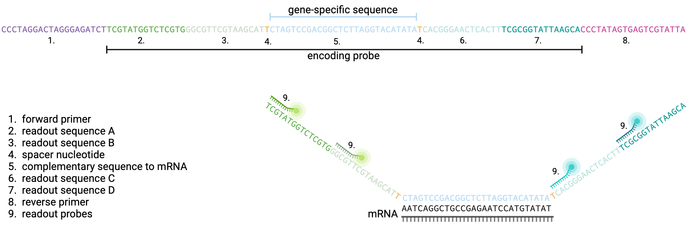
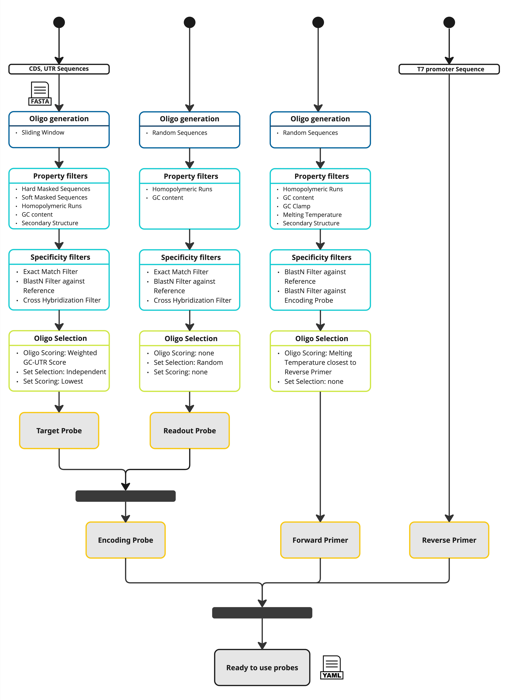

SeqFISH+ Probe Designer
==========================

SeqFISH+ (sequential fluorescence in situ hybridization) probes are short DNA oligonucleotides designed for multiplexed single-molecule FISH.
In seqFISH+, multiple rounds of hybridization and imaging are performed sequentially, enabling detailed visualization and quantification of hundreds of RNA targets in a single sample.
This technique preserves the spatial context of gene expression while providing high-throughput and single-cell resolution.

A SeqFISH+ probe is a flourescent probe that contains a 28-nt gene-specific sequence complementary to the mRNA, four 15-nt barcode sequences, which are read out by fluorescent secondary readout probes,
single T-nucleotide spacers between readout and gene-specific regions, and two 20-nt PCR primer binding sites.
The specific readout sequences contained by an encoding probe are determined by the binary barcode assigned to that RNA.

If you are using the SeqFISH+ Probe Design Pipeline, consider citing the Oligo Designer Toolsuite package [1] and in addition Kuemmerle et al. [2]
The SeqFISH+ Probe Design Pipeline follows the design steps listed in [3].

Command-Line Call
------------------

To create SeqFISH+ probes you can run the pipeline with

::

    seqfish_plus_probe_designer -c data/configs/seqfish_plus_probe_designer.yaml

where:

``-c``: config file, which contains parameter settings, specific to SeqFISH+ probe design, `seqfish_plus_probe_designer.yaml <https://github.com/HelmholtzAI-Consultants-Munich/oligo-designer-toolsuite/blob/main/data/configs/seqfish_plus_probe_designer.yaml>`__ contains default parameter settings

All steps and config parameters will be documented in a log file, that is saved in the defined output directory.
The logging file will have the format: ``log_seqfish_plus_probe_designer_{year}-{month}-{day}-{hour}-{minute}.txt``.

Python API
------------------

The SeqFISH+ probe design pipeline can also be integrated directly into Python code.
Below is an example demonstrating how this can be done.
For a complete explanation of all function parameters, refer to the API documentation.

.. code-block:: python

    ##### Initialize the SeqFISH+ Probe Designer Pipeline #####
    # We create an instance of the SeqFishPlusProbeDesigner class. This pipeline handles
    # all steps required to design probes for SeqFISH+ experiments, including target probes,
    # readout probes, primers, and final output.
    pipeline = SeqFishPlusProbeDesigner(
            write_intermediate_steps=True,
            dir_output="output_seqfishplus_probe_designer",
            n_jobs=2,
        )

    # Optional: If you need to customize certain developer parameters (for debugging, advanced usage, etc.),
    # call set_developer_parameters(...) with any overrides. By default, the pipeline uses internal defaults.
    pipeline.set_developer_parameters(...)

    ##### Design Target Probes #####
    # We first generate probes that hybridize specifically to target genes sequences.
    # The pipeline will generate multiple candidate sets (n_sets) and return them as part of the probe database.
    target_probe_database = pipeline.design_target_probes(
        files_fasta_target_probe_database=...,                  # List of FASTA files with target gene sequences
        files_fasta_reference_database_targe_probe=...,         # List of FASTA files for specificity reference
        gene_ids=...,                                           # List of gene symbols or identifiers
        target_probe_length_min=28,
        target_probe_length_max=28,
        target_probe_isoform_consensus=100,
        target_probe_GC_content_min=45,
        target_probe_GC_content_opt=55,
        target_probe_GC_content_max=65,
        target_probe_homopolymeric_base_n={"A": 5, "T": 5, "C": 5, "G": 5},
        target_probe_T_secondary_structure=76,
        target_probe_secondary_structures_threshold_deltaG=0,
        target_probe_GC_weight=1,
        target_probe_UTR_weight=10,
        set_size_opt=24,
        set_size_min=24,
        distance_between_target_probes=2,
        n_sets=100,
    )

    ##### Design Readout Probes #####
    # After we have generated valid target probes, we design short "readout probes" (barcodes) used in SeqFISH+ imaging.
    # A codebook is generated to map each gene to a unique barcode pattern.
    # The readout probe table contains the actual sequences and associated metadata for these probes.
    codebook, readout_probe_table = pipeline.design_readout_probes(
        n_genes=len(target_probe_database.database),
        files_fasta_reference_database_readout_probe=...,          # List of FASTA files for specificity reference
        readout_probe_length=15,
        readout_probe_base_probabilities={"A": 0.25, "C": 0.25, "G": 0.25, "T": 0.25},
        readout_probe_GC_content_min=40,
        readout_probe_GC_content_max=60,
        readout_probe_homopolymeric_base_n={"G": 3},
        n_barcode_rounds=4,
        n_pseudocolors=20,
        channels_ids=["Alexa488", "Cy3b", "Alexa647"],
    )

    ##### Combine Target and Readout Probes into Encoding Probes #####
    # Merges the target probe database with the codebook/readout information to create the final
    # encoding probe database, which associates each target region with its readout sequences.
    encoding_probe_database = pipeline.design_encoding_probe(
        target_probe_database=target_probe_database,
        codebook=codebook,
        readout_probe_table=readout_probe_table,
    )

    ##### Design Primers #####
    # After we have generated valid encoding probes, we design primer sequences used for amplification.
    # The reverse primer sequence has to be provided to design the forward primer.
    reverse_primer_sequence, forward_primer_sequence = pipeline.design_primers(
        encoding_probe_database=encoding_probe_database,
        files_fasta_reference_database_primer=...,                  # List of FASTA files for specificity reference
        reverse_primer_sequence="CCCTATAGTGAGTCGTATTA",
        primer_length=20,
        primer_base_probabilities={"A": 0.25, "C": 0.25, "G": 0.25, "T": 0.25},
        primer_GC_content_min=50,
        primer_GC_content_max=65,
        primer_number_GC_GCclamp=1,
        primer_number_three_prime_base_GCclamp=2,
        primer_homopolymeric_base_n={"A": 4, "T": 4, "C": 4, "G": 4},
        primer_max_len_selfcomplement=6,
        primer_max_len_complement_reverse_primer=5,
        primer_Tm_min=60,
        primer_Tm_max=75,
        primer_T_secondary_structure=76,
        primer_secondary_structures_threshold_deltaG=0,
    )

    ##### Generate Final Output #####
    # The pipeline then generates its final outputs for the 'top_n_sets'
    # best scoring probe sets to keep.
    pipeline.generate_output(
        encoding_probe_database=encoding_probe_database,
        reverse_primer_sequence=reverse_primer_sequence,
        forward_primer_sequence=forward_primer_sequence,
        top_n_sets=3,
    )

Pipeline Description
-----------------------

The pipeline has four major steps:

1) probe generation (dark blue),

2) probe filtering by sequence property and binding specificity (light blue),

3) probe set selection for each gene (green), and

4) final probe sequence generation (yellow).

For the probe generation step, the user has to provide a FASTA file with genomic sequences which is used as reference for the generation of probe sequences.
The probe sequences are generated using the ``OligoSequenceGenerator``.
Therefore, the user has to define the probe length (can be given as a range), and optionally provide a list of gene identifiers (matching the gene identifiers of the annotation file) for which probes should be generated.
If no gene list is given, probes are generated for all genes in the reference.
The probe sequences are generated in a sliding window fashion from the DNA sequence of the non-coding strand, assuming that the sequence of the coding strand represents the target sequence of the probe.
The generated probes are stored in a FASTA file, where the header of each sequence stores the information about its reference region and genomic coordinates.
In a next step, this FASTA file is used to create an ``OligoDatabase``, which contains all possible probes for a given set of genes.
When the probe sequences are loaded into the database, all probes of one gene having the exact same sequence are merged into one entry, saving the transcript, exon and genomic coordinate information of the respective probes.

In the second step, the number of probes per gene is reduced by applying different sequence property (``PropertyFilter``) and binding specificity filters (``SpecificityFilter``).
For the SeqFISH+ protocol, the following filters are applied: removal of sequences that contain unidentified nucleotides (``HardMaskedSequenceFilter``), that contain low-complexity region like repeat regions (``SoftMaskedSequenceFilter``), that have a GC content (``GCContentFilter``) outside a user-specified range, that contain homopolymeric runs of any nucleotide longer than a user-specified threshold (``HomopolymericRunsFilter``), that contain secondary structures like hairpins below a user-defined free energy threshold (``SecondaryStructureFilter``).
After removing probes with undesired sequence properties from the database, the probe database is checked for probes that potentially cross-hybridize, i.e. probes from different genes that have the exact same or similar sequence.
Those probes are removed from the database to ensure uniqueness of probes for each gene.
Cross-hybridizing probes are identified with the ``CrossHybridizationFilter`` that uses a BlastN alignment search to identify similar sequences and removes those hits with the ``RemoveByBiggerRegionPolicy`` that sequentially removes the probes from the genes that have the bigger probe sets.
Next, the probes are checked for off-target binding with any other region of a provided background reference.
Off-target regions are sequences of the background reference (e.g. transcriptome or genome) which match the probe region with a certain degree of homology but are not located within the gene region of the probe.
Those off-target regions are identified with the ``BlastNFilter`` that removes probes where a BlastN alignment search found off-target sequence matches with a certain coverage and similarity, for which the user has to define thresholds.

In the third step of the pipeline, the best sets of non-overlapping probes are identified for each gene.
The ``OligosetGeneratorIndependentSet`` class is used to generate ranked, non-overlapping probe sets where each probe and probe set is scored according to a protocol dependent scoring function, i.e. by the distance to the optimal melting temperature penalized if located in a 5’ UTR of the probes in the set.
Following this step all genes with insufficient number of probes (user-defined) are removed from the database and stored in a separate file for user-inspection.

In the last step of the pipeline, the ready-to-order probe sequences containing all additional required sequences are designed for the best non-overlapping sets of each gene.
For the SeqFISH+ protocol, four readout sequences are added to the probe, creating the encoding probes.
A pool of readout probe sequences is created from random sequences with user-defined per base probability that have a GC content (``GCContentFilter``) within a user-specified range and no homopolymeric runs of three or more G nucleotides (``HomopolymericRunsFilter``).
Additionally, the readout probes are checked for off-target binding (``BlastNFilter``) against the transcriptome and cross-hybridization (``CrossHybridizationFilter``) against other readout probe sequences where hits are removed with the ``RemoveByDegreePolicy`` that iteratively removes readout probes with the highest number of hits against other readout probes.
The readout probes are assigned to the probes according to a protocol-specific encoding scheme described in Eng et al. [3].
In addition, one forward and one reverse primer is provided.
The reverse primer is the 20nt T7 promoter sequence (TAATACGACTCACTATAGGG) and the forward primer is created from a random sequence with user-defined per base probability that fulfills the following criteria: GC content (``GCContentFilter``) and melting temperature (``MeltingTemperatureNNFilter``) within a user-specified range, CG clamp at 3’ terminal end of the sequence (``GCClampFilter``), no homopolymeric runs of any nucleotide longer than a user-specified threshold (``HomopolymericRunsFilter``), no  secondary structures below a user-defined free energy threshold (``SecondaryStructureFilter``).
Furthermore, the forward primer sequence is checked for off-target binding (``BlastNFilter``) against the transcriptome, the encoding probes and T7 primer.

The output is stored in two separate files:

- ``seqfish_plus_probes_order.yml``: contains for each probe the sequences of the seqfish+ probe and the detection oligo.
- ``seqfish_plus_probes.yml``: contains a detailed description for each probe, including the sequences of each part of the probe and probe specific attributes.

All default parameters can be found in the `seqfish_plus_probe_designer.yaml <https://github.com/HelmholtzAI-Consultants-Munich/oligo-designer-toolsuite/blob/main/data/configs/seqfish_plus_probe_designer.yaml>`__ config file provided along the repository.

.. [1] Mekki, I., Campi, F., Kuemmerle, L. B., ... & Barros de Andrade e Sousa, L. (2023). Oligo Designer Toolsuite. Zenodo, https://doi.org/10.5281/zenodo.7823048
.. [2] Kuemmerle, L. B., Luecken, M. D., Firsova, A. B., Barros de Andrade e Sousa, L., Straßer, L., Mekki, I. I., ... & Theis, F. J. (2024). Probe set selection for targeted spatial transcriptomics. Nature methods, 1-11. https://doi.org/10.1038/s41592-024-02496-z
.. [3] Eng, C. H. L., Lawson, M., Zhu, Q., Dries, R., Koulena, N., Takei, Y., ... & Cai, L. (2019). Transcriptome-scale super-resolved imaging in tissues by RNA seqFISH+. Nature, 568(7751), 235-239. https://doi.org/10.1038/s41586-019-1049-y
