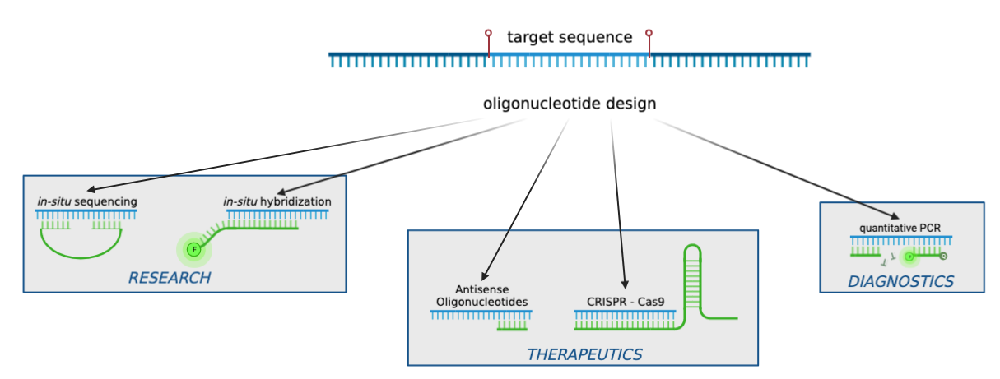

.. oligo-designer-toolsuite documentation master file, created by
   sphinx-quickstart on Thu Oct 13 15:49:40 2022.
   You can adapt this file completely to your liking, but it should at least
   contain the root `toctree` directive.

*Oligo Designer Toolsuite* - Lightweight Development of Custom Oligo Design Pipelines
=======================================================================================

Oligonucleotides (abbrev. oligos) are short, synthetic strands of DNA or RNA that are designed with respect to a specific target region and
have many application areas, ranging from research to disease diagnosis or therapeutics.
Oligos can be used as primers during DNA amplification, as probes for *in-situ* hybridization or as guide RNAs for CRISPR-based gene editing.
Based on the intended application and experimental design, researchers have to customize the length, sequence composition, and thermodynamic
properties of the designed oligos.

|image0|

Various tools exist that provide custom design of oligo sequences depending on the area of application. Even though most tools apply the same 
basic processing steps, ranging from the generation of custom-length oligo sequences, the filtering of oligo sequences based on thermodynamic 
properties as well as the selection of an optimal set of oligos, each newly developed tool uses its own implementation and different package 
dependencies. Consequently, not only the development of new tools is slowed down, but also the maintenance and modification of existing tools 
is hampered, because developers do not have a common resource for those functionalities to use. We tackle this issue with our open-source 
*Oligo Designer Toolsuite*.

**Oligo Designer Toolsuite is a collection of modules that provides all basic functionalities for custom oligo design pipelines as well as 
advanced experiment-specific functionalities like machine learning models for oligo specificity prediction within a flexible Python framework.** 

To allow the flexible usage of different modules, depending on the required processing steps, we developed a common underlying data structure that 
ensures the cross-compatibility of all modules within the framework. This data structure is runtime and memory optimized to enable the processing of 
large sequence dataset in a reasonable time frame. With our Oligo Designer Toolsuite we aim to set new standards in the development of oligo design 
pipelines, helping to accelerate the development of new tools and facilitate the upgrade of existing tools with the latest developments in the field. 
We also provide ready-to-use oligo design pipelines for specific experimental setups, e.g. SCRINSHOT or SeqFISH+ probe design for Spatial Transcriptomics.

.. toctree::
   :maxdepth: 2
   :caption: GETTING STARTED

   _getting_started/installation.rst
   _getting_started/introduction_framework.rst
   _getting_started/build_a_custom_pipeline
   _getting_started/tutorials/

.. toctree::
   :maxdepth: 1
   :caption: PIPELINES

   _pipelines/genomic_region_generator
   _pipelines/scrinshot_probe_designer
   _pipelines/merfish_probe_designer
   _pipelines/seqfishplus_probe_designer
   _pipelines/oligoseq_probe_designer

.. toctree::
   :maxdepth: 2
   :caption: API Documentation:

   _api_docs/oligo_designer_toolsuite.rst

Contributing
-------------

Contributions are more than welcome! Everything from code to notebooks to examples and documentation are all equally valuable so please don't feel you 
can't contribute. To contribute please fork the project make your changes and submit a pull request. We will do our best to work through any issues with 
you and get your code merged into the main branch.

For any further inquiries please send an email to `Lisa Barros de Andrade e Sousa <mailto:lisa.barros@helmholtz-munich.de>`_
or `Isra Mekki <mailto:isra.mekki@helmholtz-munich.de>`_.

How to cite
------------

If the Oligo Designer Toolsuite is useful for your research, consider citing the package:

::

   @software{campi_2023_7823048,
      author       = { Isra Mekki,
                     Francesco Campi,  
                     Louis Kümmerle,
                     Chelsea Bright,
                     Malte Lücken
                     Fabian Theis,
                     Marie Piraud,
                     Lisa Barros de Andrade e Sousa
                     },
      title        = {{Oligo Designer Toolsuite}},
      year         = 2023,
      publisher    = {Zenodo},
      version      = {v0.1.3},
      doi          = {10.5281/zenodo.7823048},
      url          = {https://doi.org/10.5281/zenodo.7823048}
   }

License
--------

``oligo-designer-toolsuite`` is released under the MIT license. See `LICENSE <https://github.com/HelmholtzAI-Consultants-Munich/oligo-designer-toolsuite/blob/dev/LICENSE>`_ for additional details about it.
